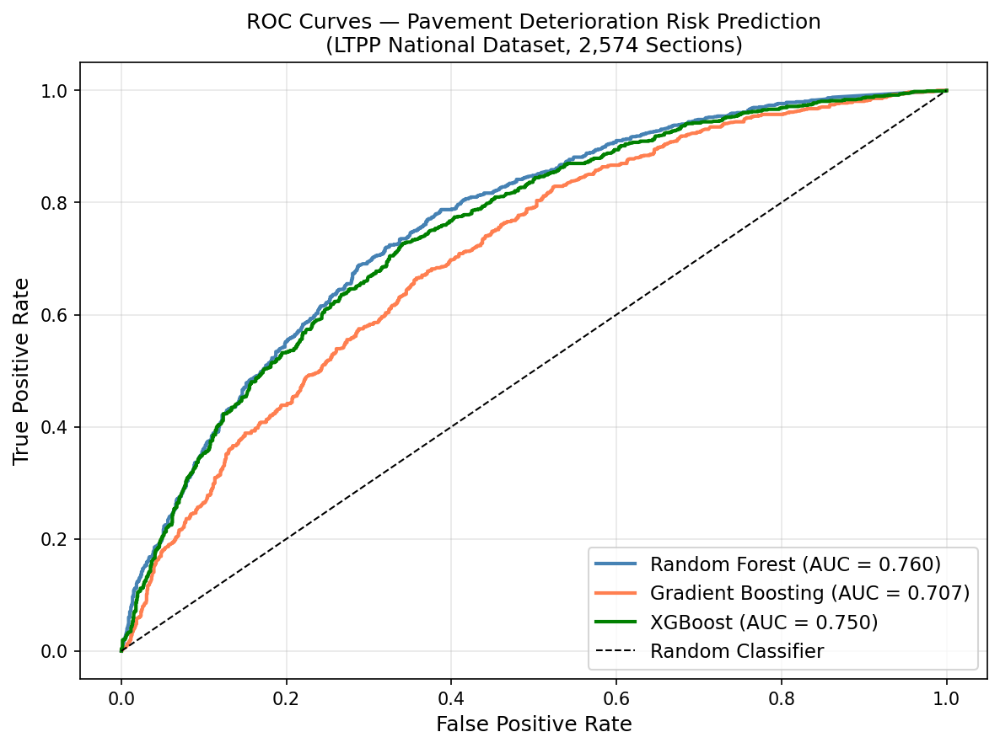
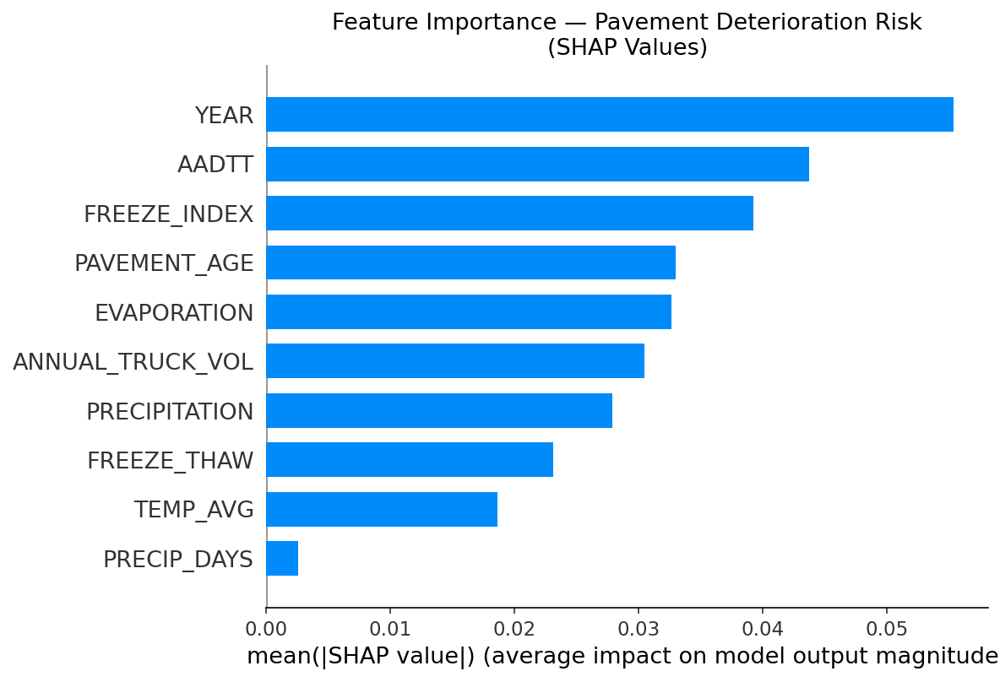
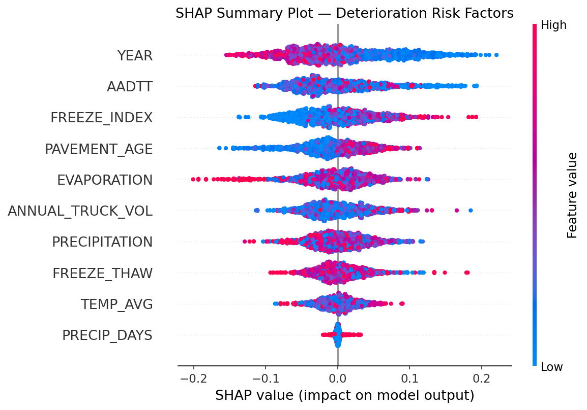
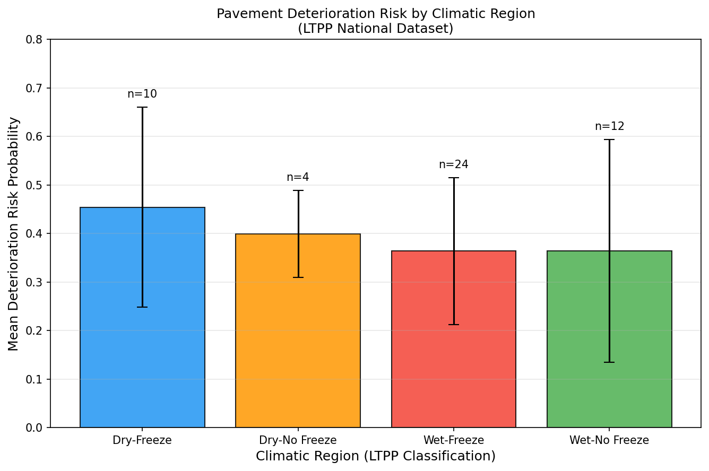
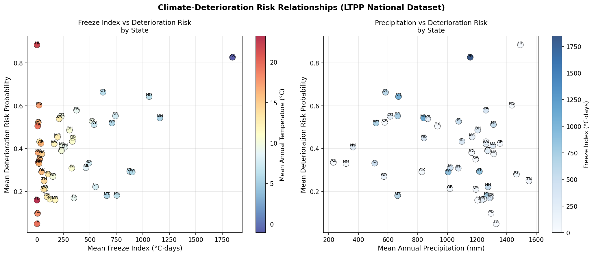

# LTPP Pavement Deterioration Under Climate Variability

**Paper:** Machine Learning Based Prediction of Pavement Deterioration Risk Under Climate Variability: A National Scale Analysis Using the Long Term Pavement Performance Database

**Journal:** Transportation Geotechnics  
**Manuscript No:** TRGEO-D-26-01076  
**Authors:** Metehan Alp Memis, Sevval Ulus Memis  
**Affiliation:** Southern Illinois University Edwardsville (SIUE)

---

## Research Question

How do climate, traffic, and pavement-related factors influence long-term pavement deterioration risk across the LTPP network, and which factors contribute most strongly to predicted deterioration?

## Repository Structure

```text
ltpp-pavement-deterioration/
├── 01_sql_restore.sql
├── 02_data_extraction.py
├── 03_ml_pipeline.py
├── 04_shap_analysis.py
├── 05_spatial_analysis.py
├── README.md
├── requirements.txt
├── CITATION.cff
├── LICENSE
├── .gitignore
├── figures/
└── results/
```

## Data Source

Data were retrieved from the **LTPP InfoPave** portal (Standard Data Release 39):

- Bucket #141968: IRI, Traffic, Performance (ARPED + ARTRD)
- Bucket #141969: MERRA Climate (ARCLD)
- Bucket #141971: Materials (ARMAD)

InfoPave: https://infopave.fhwa.dot.gov

## Methods

The workflow integrates pavement performance, traffic, MERRA climate, and material-related data from the LTPP InfoPave database. Annual section-level observations are constructed through SQL-based extraction and Python preprocessing.

Three machine-learning classifiers are evaluated:

- Random Forest
- Gradient Boosting
- XGBoost

Model performance is assessed using classification metrics and ROC-AUC. SHAP is used to interpret global feature contributions, while regional analyses examine predicted deterioration risk across climatic zones and U.S. states.

## Requirements

```bash
pip install -r requirements.txt
```

Main dependencies include pandas, NumPy, scikit-learn, XGBoost, SHAP, SQLAlchemy, pyodbc, matplotlib, seaborn, Plotly, and joblib.

## Workflow

1. Download the required `.bak` files from LTPP InfoPave.
2. Run `01_sql_restore.sql` in SQL Server Management Studio.
3. Run `02_data_extraction.py` to merge and clean LTPP tables.
4. Run `03_ml_pipeline.py` to train and evaluate models.
5. Run `04_shap_analysis.py` to generate SHAP explainability outputs.
6. Run `05_spatial_analysis.py` to generate state-level and climatic-region risk analyses.

## Key Results

| Model | Accuracy | AUC-ROC |
|---|---:|---:|
| Random Forest | 0.699 | **0.760** |
| XGBoost | 0.694 | 0.750 |
| Gradient Boosting | 0.658 | 0.707 |

- Freeze Index was the dominant climatic predictor in the SHAP analysis.
- Dry-Freeze regions showed the highest mean deterioration risk in the repository summary.
- Dataset: 2,574 pavement sections and 27,023 annual observations spanning 1990-2024.

## Selected Results

### Model Performance



### Model Explainability





### Regional Climate Analysis





## Reproducibility

Raw LTPP database backup files and generated large intermediate files are not included in this repository. The analysis is designed to be reproduced by downloading the required LTPP InfoPave data releases and running the scripts in sequence.

> Note: A future methodological enhancement should evaluate section-level or spatially grouped train/test splitting to reduce the risk that repeated observations from the same pavement section appear in both training and test sets.

## Citation

```text
Memis, M.A., Ulus Memis, S. (2026).
Machine Learning Based Prediction of Pavement Deterioration Risk Under Climate Variability:
A National Scale Analysis Using the Long Term Pavement Performance Database.
Transportation Geotechnics. TRGEO-D-26-01076.
```

## License

This repository is released under the MIT License. See `LICENSE` for details.
